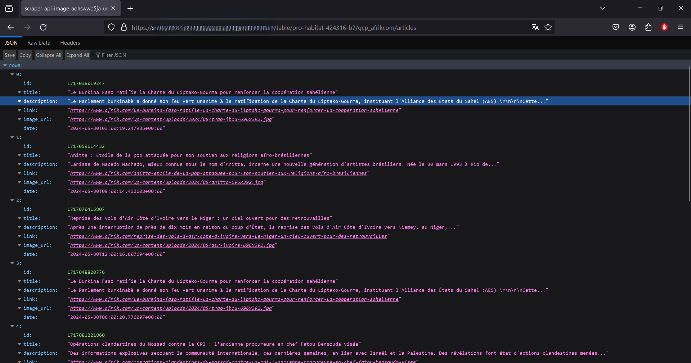

# FastAPI avec BigQuery

This project is a FastAPI application that connects to Google BigQuery.
Ce projet est la suite de mon application de scraping qui scrappe les données sur le site afrik.com et stock ses données dans BigQuery.
Cette fois-ci nous avons développé une API avec FastAPI qui retourne ses données selon l'URI renseigné.


## Prérequis

- Docker
- Compte Google Cloud Platform
- Packages Python : `fastapi`, `pydantic`, `google-cloud-bigquery`
- Compte de service avec la permission d'accéder à BigQuery 


## Etapes du projet

- Développement de l'api avec FastAPI avec Python
- Constuction de l'image du projet avec Docker
- Stockage, Deploiement et plannification du conteneur sur GCP(Artifact Registry, Cloud Run Services et Cloud Scheduler)


## Déploiement sur GCP

1. Construire l'image Docker localement
```bash
docker build -t scraper-api:latest

```

2. Lier l'image précément crée à votre projet repo Artifact registry
```bash
docker tag scraper-api:latest us-central1-docker.pkg.dev/pro-habitat-424316-b7/afrikcom-repo/scraper-api-image

```

3. Pusher l'image vers Artifact Registry
```bash
docker push us-central1-docker.pkg.dev/pro-habitat-424316-b7/afrikcom-repo/scraper-api-image

```

4. Déployer le scraper avec Cloud Run via l'interface Web
- Créer un service sur Cloud Run, 
- Associez y l'image dispo sur Artifact Registry,
- Configurer le port sur 8000
- Créer le service
- Cliquer sur l'url disponible après la création du service


5. Route de l'API
- /table/{project_id}/{dataset_id}/{table_id}

EX: /table/pro-habitat-424316-b7/gcp_afrikcom/articles

Vous devriez voir s'affichez les données dispo sur BigQuery


6. Suivre ce [tuto](https://www.youtube.com/watch?v=fmGhBvA5tSo&list=LL&index=1&t=153s) pour savoir comment créer un compte de service, donnée des droit et accéder à la clé


## Captures

